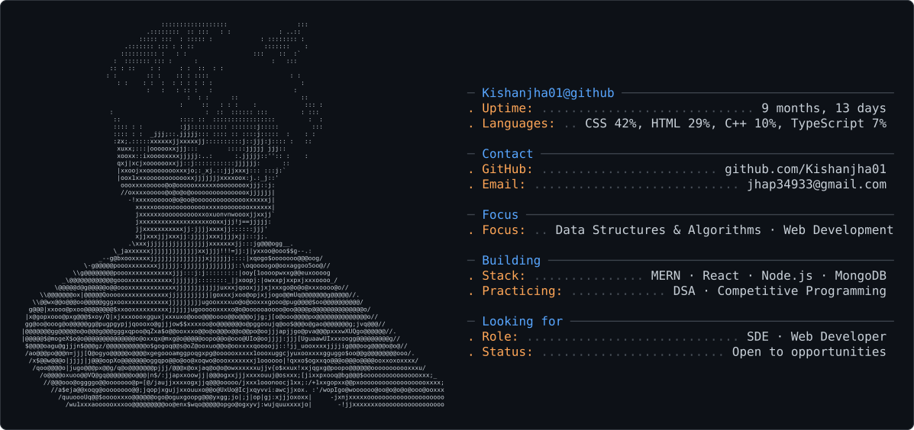

<picture>
  <source media="(prefers-color-scheme: dark)" srcset="kishan_dark_mode.svg" />
  <source media="(prefers-color-scheme: light)" srcset="kishan_light_mode.svg" />
  
</picture>

# Hi, I'm Kishan Jha 👋

**Web Developer · Competitive Programmer · DSA Enthusiast**

I build web applications and enjoy solving algorithmic problems. I like working on practical software projects while continuously improving my problem-solving and programming skills.

## 🚀 What I Do

**→ Web Development** 
**→ Data Structures & Algorithms** 
**→ Competitive Programming** 
**→ Backend Development** 
**→ Problem Solving** 
**→ Software Development**

## 💻 Development

**→ Building responsive and interactive web applications** 
**→ Developing backend services and APIs** 
**→ Working with databases and server-side systems** 
**→ Turning ideas into practical software projects**

## 🧠 Competitive Programming

**→ Data Structures & Algorithms** 
**→ Algorithmic Problem Solving** 
**→ Competitive Programming** 
**→ Complexity Analysis** 
**→ Contest Practice**

## 🔨 Currently

**→ Building web development projects** 
**→ Practicing DSA and competitive programming** 
**→ Improving problem-solving and algorithmic thinking** 
**→ Learning new tools and technologies** 
**→ Working on projects that strengthen my software engineering skills**

## 🌐 Connect With Me

## 🛠️ Tech Stack

### Languages

### Web Development

### Tools

